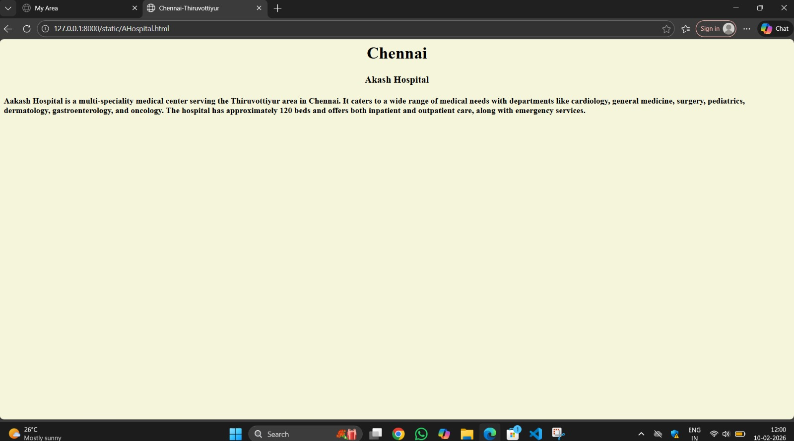
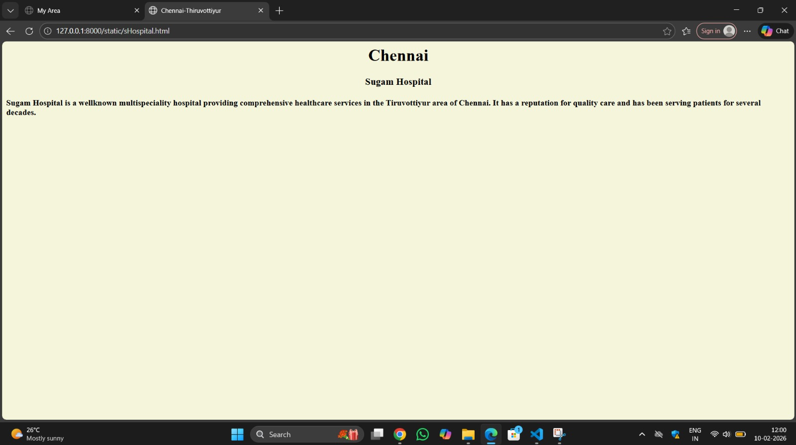
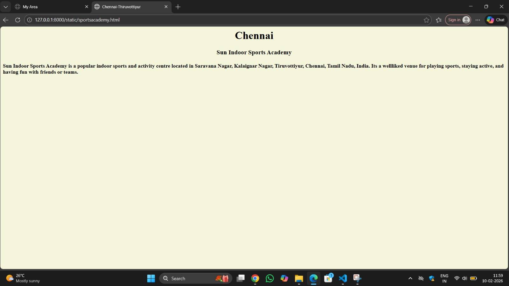
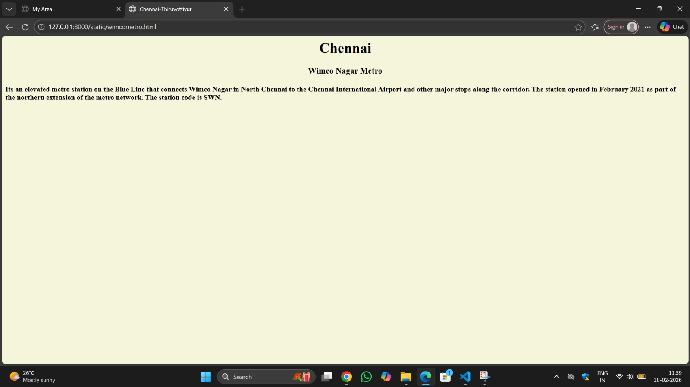

# Ex03 Places Around Me
## Date:10/02/2026

## AIM
To develop a website to display details about the places around my house.

## DESIGN STEPS

### STEP 1
Create a Django admin interface.

### STEP 2
Download your city map from Google as an image.

### STEP 3
Insert the image using `````` tag and link it to the map.

### STEP 4
Using ```<map>``` tag name the map.

### STEP 5
Create clickable regions in the image using ```<area>``` tag.

### STEP 6
Write HTML programs for all the regions identified.

### STEP 7
Execute the programs and publish them.

## CODE
```
<html>
    <head>
        <title>My Area</title>
    </head>
    <body>
        <h1 align="center">Thiruvottiyur-Chennai</h1>
        <h2 align="center">Shubnum Fathima (25010692)</h2>
        

<map name="image-map">
    <area target="" alt="Akash" title="Akash" href="AHospital.html" coords="872,297,1010,365" shape="rect">
    <area target="" alt="tiruvottiyur railway station" title="tiruvottiyur railway station" href="Railway.html" coords="501,649,634,705" shape="rect">
    <area target="" alt="sun sports" title="sun sports" href="sportsacademy.html" coords="618,188,793,253" shape="rect">
    <area target="" alt="Sugam" title="Sugam" href="sHospital.html" coords="820,423,971,497" shape="rect">
    <area target="" alt="metro station" title="metro station" href="wimcometro.html" coords="775,8,956,48" shape="rect">
</map>
    </body>
</html>


AHospital.html
<html>
    <head>
        <title>Chennai-Thiruvottiyur</title>
    </head>
    <body bgcolor="beige">
        <h1 align="center">Chennai</h1>
        <h3 align="center">Akash Hospital</h3>
        <h4>Aakash Hospital is a multi-speciality medical center serving the Thiruvottiyur area in Chennai. It caters to a wide range of medical needs with departments like cardiology, general medicine, surgery, pediatrics, dermatology, gastroenterology, and oncology. The hospital has approximately 120 beds and offers both inpatient and outpatient care, along with emergency services.</h4>
    </body>
</html>


Railway.html
<html>
    <head>
        <title>Chennai-Thiruvottiyur</title>
    </head>
    <body bgcolor="beige">
        <h1 align="center">Chennai</h1>
        <h3 align="center">Thiruvottiyur Railway Station</h3>
        <h4>Tiruvottiyur Railway Station is an active suburban railway station on the Chennai Suburban Railway Network. It serves the northern Chennai suburb of Tiruvottiyur and is part of the Chennai Central to Gummidipoondi section. The station code is TVT.</h4>
    </body>
</html>


sHospital.html
<html>
    <head>
        <title>Chennai-Thiruvottiyur</title>
    </head>
    <body bgcolor="beige">
        <h1 align="center">Chennai</h1>
        <h3 align="center">Sugam Hospital</h3>
        <h4>Sugam Hospital is a wellknown multispeciality hospital providing comprehensive healthcare services in the Tiruvottiyur area of Chennai. It has a reputation for quality care and has been serving patients for several decades.</h4>
    </body>
</html>


sportsacademy.html
<html>
    <head>
        <title>Chennai-Thiruvottiyur</title>
    </head>
    <body bgcolor="beige">
        <h1 align="center">Chennai</h1>
        <h3 align="center">Sun Indoor Sports Academy</h3>
        <h4>Sun Indoor Sports Academy is a popular indoor sports and activity centre located in Saravana Nagar, Kalaignar Nagar, Tiruvottiyur, Chennai, Tamil Nadu, India. Its a wellliked venue for playing sports, staying active, and having fun with friends or teams.</h4>
    </body>
</html>


wimcometro.html
<html>
    <head>
        <title>Chennai-Thiruvottiyur</title>
    </head>
    <body bgcolor="beige">
        <h1 align="center">Chennai</h1>
        <h3 align="center">Wimco Nagar Metro</h3>
        <h4>Its an elevated metro station on the Blue Line that connects Wimco Nagar in North Chennai to the Chennai International Airport and other major stops along the corridor. The station opened in February 2021 as part of the northern extension of the metro network. The station code is SWN.</h4>
    </body>
</html>
```

## OUTPUT







## RESULT
The program for implementing image maps using HTML is executed successfully.
